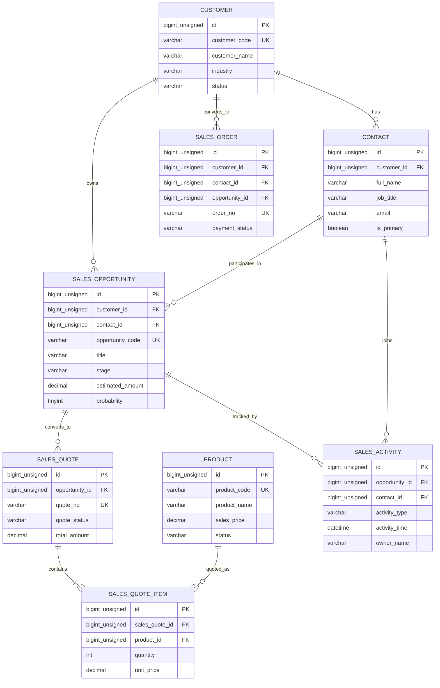

# CRM 数据模型调研

CRM 系统通常围绕客户开发、联系人管理、商机跟进、报价与订单转化等过程建模，核心目标是把销售漏斗中的客户关系信息沉淀为结构化数据。

```mermaid
erDiagram
    CUSTOMER ||--o{ CONTACT : has
    CUSTOMER ||--o{ SALES_OPPORTUNITY : owns
    CONTACT ||--o{ SALES_OPPORTUNITY : participates_in
    SALES_OPPORTUNITY ||--o{ SALES_QUOTE : converts_to
    SALES_QUOTE ||--|{ SALES_QUOTE_ITEM : contains
    PRODUCT ||--o{ SALES_QUOTE_ITEM : quoted_as
    SALES_OPPORTUNITY ||--o{ SALES_ACTIVITY : tracked_by
    CONTACT ||--o{ SALES_ACTIVITY : joins
    CUSTOMER ||--o{ SALES_ORDER : converts_to

    CUSTOMER {
        bigint_unsigned id PK
        varchar customer_code UK
        varchar customer_name
        varchar industry
        varchar status
    }
    CONTACT {
        bigint_unsigned id PK
        bigint_unsigned customer_id FK
        varchar full_name
        varchar job_title
        varchar email
        boolean is_primary
    }
    SALES_OPPORTUNITY {
        bigint_unsigned id PK
        bigint_unsigned customer_id FK
        bigint_unsigned contact_id FK
        varchar opportunity_code UK
        varchar title
        varchar stage
        decimal estimated_amount
        tinyint probability
    }
    SALES_ACTIVITY {
        bigint_unsigned id PK
        bigint_unsigned opportunity_id FK
        bigint_unsigned contact_id FK
        varchar activity_type
        datetime activity_time
        varchar owner_name
    }
    SALES_QUOTE {
        bigint_unsigned id PK
        bigint_unsigned opportunity_id FK
        varchar quote_no UK
        varchar quote_status
        decimal total_amount
    }
    SALES_QUOTE_ITEM {
        bigint_unsigned id PK
        bigint_unsigned sales_quote_id FK
        bigint_unsigned product_id FK
        int quantity
        decimal unit_price
    }
    PRODUCT {
        bigint_unsigned id PK
        varchar product_code UK
        varchar product_name
        decimal sales_price
        varchar status
    }
    SALES_ORDER {
        bigint_unsigned id PK
        bigint_unsigned customer_id FK
        bigint_unsigned contact_id FK
        bigint_unsigned opportunity_id FK
        varchar order_no UK
        varchar payment_status
    }
```
