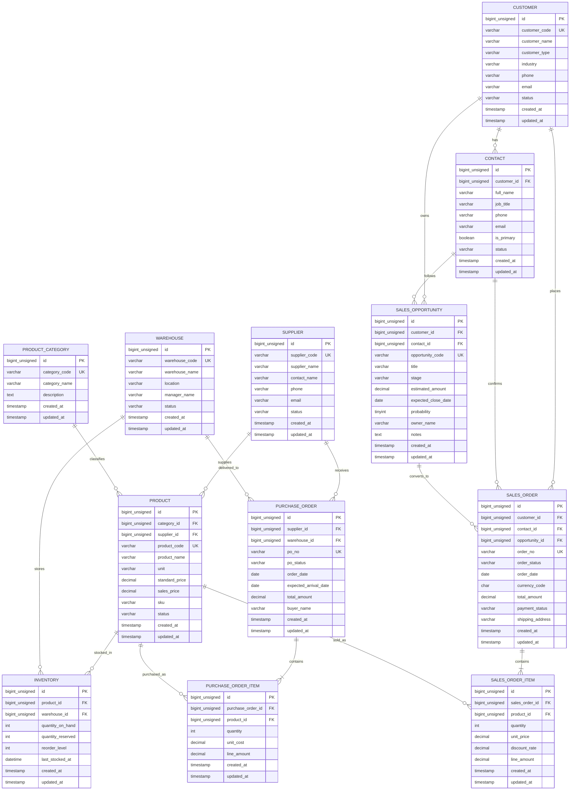

# ERP + CRM 融合核心业务数据模型

该模型融合了 CRM 的客户、联系人、商机、销售转化链路，以及 ERP 的产品、供应商、库存、采购、订单履约链路，可支撑“从客户开发到销售成交，再到采购补货与库存管理”的核心业务闭环。

```mermaid
erDiagram
    CUSTOMER ||--o{ CONTACT : has
    CUSTOMER ||--o{ SALES_OPPORTUNITY : owns
    CONTACT ||--o{ SALES_OPPORTUNITY : follows

    SUPPLIER ||--o{ PRODUCT : supplies
    PRODUCT_CATEGORY ||--o{ PRODUCT : classifies
    PRODUCT ||--o{ INVENTORY : stocked_in
    WAREHOUSE ||--o{ INVENTORY : stores

    CUSTOMER ||--o{ SALES_ORDER : places
    CONTACT ||--o{ SALES_ORDER : confirms
    SALES_OPPORTUNITY ||--o{ SALES_ORDER : converts_to
    SALES_ORDER ||--|{ SALES_ORDER_ITEM : contains
    PRODUCT ||--o{ SALES_ORDER_ITEM : sold_as

    SUPPLIER ||--o{ PURCHASE_ORDER : receives
    WAREHOUSE ||--o{ PURCHASE_ORDER : delivered_to
    PURCHASE_ORDER ||--|{ PURCHASE_ORDER_ITEM : contains
    PRODUCT ||--o{ PURCHASE_ORDER_ITEM : purchased_as

    CUSTOMER {
        bigint_unsigned id PK
        varchar customer_code UK
        varchar customer_name
        varchar customer_type
        varchar industry
        varchar phone
        varchar email
        varchar status
        timestamp created_at
        timestamp updated_at
    }
    CONTACT {
        bigint_unsigned id PK
        bigint_unsigned customer_id FK
        varchar full_name
        varchar job_title
        varchar phone
        varchar email
        boolean is_primary
        varchar status
        timestamp created_at
        timestamp updated_at
    }
    SUPPLIER {
        bigint_unsigned id PK
        varchar supplier_code UK
        varchar supplier_name
        varchar contact_name
        varchar phone
        varchar email
        varchar status
        timestamp created_at
        timestamp updated_at
    }
    PRODUCT_CATEGORY {
        bigint_unsigned id PK
        varchar category_code UK
        varchar category_name
        text description
        timestamp created_at
        timestamp updated_at
    }
    PRODUCT {
        bigint_unsigned id PK
        bigint_unsigned category_id FK
        bigint_unsigned supplier_id FK
        varchar product_code UK
        varchar product_name
        varchar unit
        decimal standard_price
        decimal sales_price
        varchar sku
        varchar status
        timestamp created_at
        timestamp updated_at
    }
    WAREHOUSE {
        bigint_unsigned id PK
        varchar warehouse_code UK
        varchar warehouse_name
        varchar location
        varchar manager_name
        varchar status
        timestamp created_at
        timestamp updated_at
    }
    INVENTORY {
        bigint_unsigned id PK
        bigint_unsigned product_id FK
        bigint_unsigned warehouse_id FK
        int quantity_on_hand
        int quantity_reserved
        int reorder_level
        datetime last_stocked_at
        timestamp created_at
        timestamp updated_at
    }
    SALES_OPPORTUNITY {
        bigint_unsigned id PK
        bigint_unsigned customer_id FK
        bigint_unsigned contact_id FK
        varchar opportunity_code UK
        varchar title
        varchar stage
        decimal estimated_amount
        date expected_close_date
        tinyint probability
        varchar owner_name
        text notes
        timestamp created_at
        timestamp updated_at
    }
    SALES_ORDER {
        bigint_unsigned id PK
        bigint_unsigned customer_id FK
        bigint_unsigned contact_id FK
        bigint_unsigned opportunity_id FK
        varchar order_no UK
        varchar order_status
        date order_date
        char currency_code
        decimal total_amount
        varchar payment_status
        varchar shipping_address
        timestamp created_at
        timestamp updated_at
    }
    SALES_ORDER_ITEM {
        bigint_unsigned id PK
        bigint_unsigned sales_order_id FK
        bigint_unsigned product_id FK
        int quantity
        decimal unit_price
        decimal discount_rate
        decimal line_amount
        timestamp created_at
        timestamp updated_at
    }
    PURCHASE_ORDER {
        bigint_unsigned id PK
        bigint_unsigned supplier_id FK
        bigint_unsigned warehouse_id FK
        varchar po_no UK
        varchar po_status
        date order_date
        date expected_arrival_date
        decimal total_amount
        varchar buyer_name
        timestamp created_at
        timestamp updated_at
    }
    PURCHASE_ORDER_ITEM {
        bigint_unsigned id PK
        bigint_unsigned purchase_order_id FK
        bigint_unsigned product_id FK
        int quantity
        decimal unit_cost
        decimal line_amount
        timestamp created_at
        timestamp updated_at
    }
```
