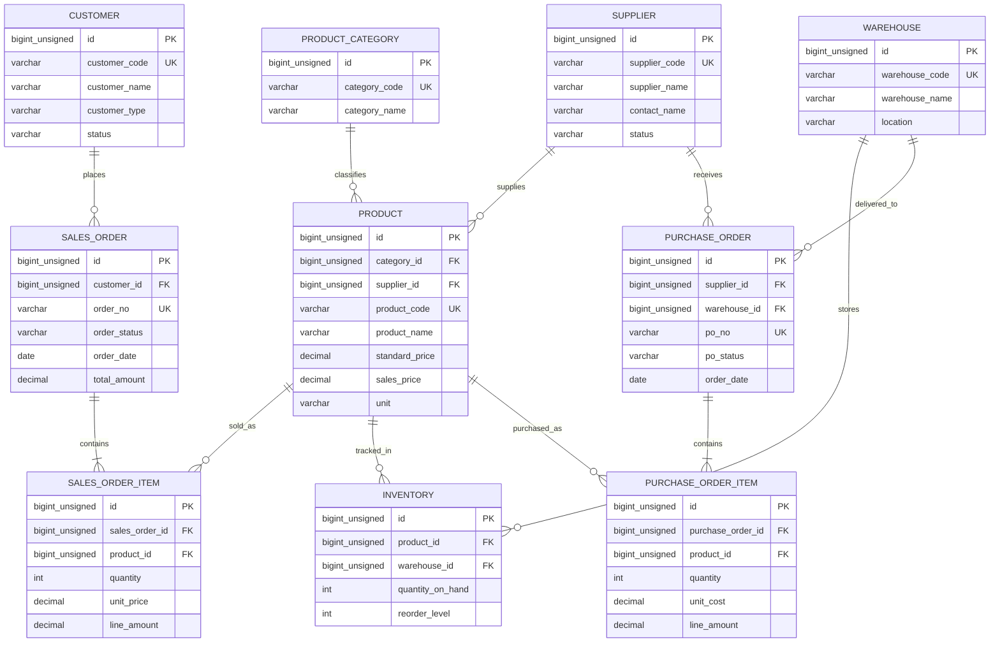

# ERP 数据模型调研

ERP 系统通常围绕采购、库存、产品、订单履约等流程建模，核心关注物料主数据、库存余额、采购单据和销售单据之间的联动关系。

```mermaid
erDiagram
    CUSTOMER ||--o{ SALES_ORDER : places
    SALES_ORDER ||--|{ SALES_ORDER_ITEM : contains
    PRODUCT ||--o{ SALES_ORDER_ITEM : sold_as

    SUPPLIER ||--o{ PRODUCT : supplies
    PRODUCT_CATEGORY ||--o{ PRODUCT : classifies

    PRODUCT ||--o{ INVENTORY : tracked_in
    WAREHOUSE ||--o{ INVENTORY : stores

    SUPPLIER ||--o{ PURCHASE_ORDER : receives
    PURCHASE_ORDER ||--|{ PURCHASE_ORDER_ITEM : contains
    PRODUCT ||--o{ PURCHASE_ORDER_ITEM : purchased_as
    WAREHOUSE ||--o{ PURCHASE_ORDER : delivered_to

    CUSTOMER {
        bigint_unsigned id PK
        varchar customer_code UK
        varchar customer_name
        varchar customer_type
        varchar status
    }
    SUPPLIER {
        bigint_unsigned id PK
        varchar supplier_code UK
        varchar supplier_name
        varchar contact_name
        varchar status
    }
    PRODUCT_CATEGORY {
        bigint_unsigned id PK
        varchar category_code UK
        varchar category_name
    }
    PRODUCT {
        bigint_unsigned id PK
        bigint_unsigned category_id FK
        bigint_unsigned supplier_id FK
        varchar product_code UK
        varchar product_name
        decimal standard_price
        decimal sales_price
        varchar unit
    }
    WAREHOUSE {
        bigint_unsigned id PK
        varchar warehouse_code UK
        varchar warehouse_name
        varchar location
    }
    INVENTORY {
        bigint_unsigned id PK
        bigint_unsigned product_id FK
        bigint_unsigned warehouse_id FK
        int quantity_on_hand
        int reorder_level
    }
    PURCHASE_ORDER {
        bigint_unsigned id PK
        bigint_unsigned supplier_id FK
        bigint_unsigned warehouse_id FK
        varchar po_no UK
        varchar po_status
        date order_date
    }
    PURCHASE_ORDER_ITEM {
        bigint_unsigned id PK
        bigint_unsigned purchase_order_id FK
        bigint_unsigned product_id FK
        int quantity
        decimal unit_cost
        decimal line_amount
    }
    SALES_ORDER {
        bigint_unsigned id PK
        bigint_unsigned customer_id FK
        varchar order_no UK
        varchar order_status
        date order_date
        decimal total_amount
    }
    SALES_ORDER_ITEM {
        bigint_unsigned id PK
        bigint_unsigned sales_order_id FK
        bigint_unsigned product_id FK
        int quantity
        decimal unit_price
        decimal line_amount
    }
```
