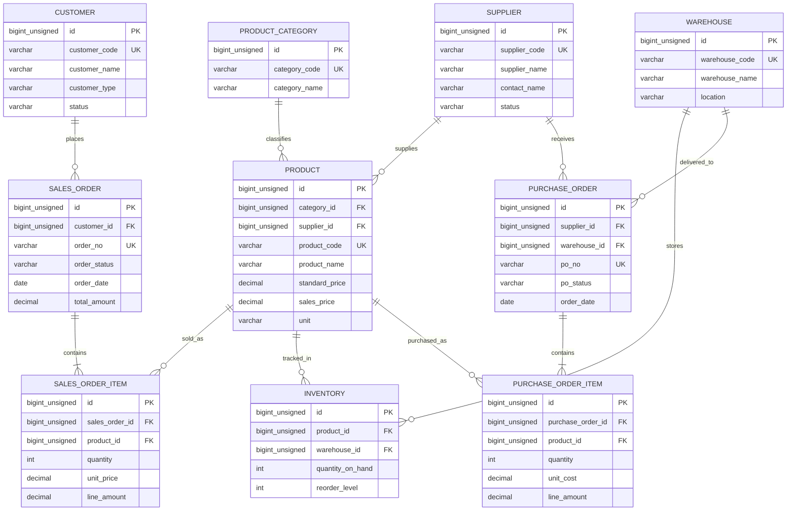
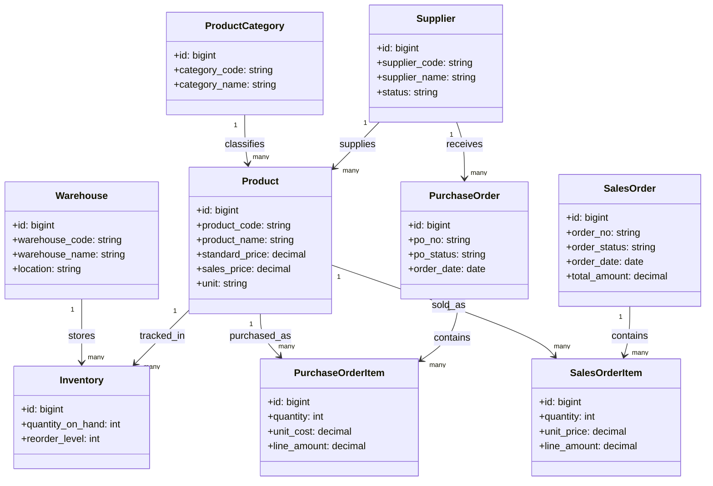

# ERP 数据模型调研

ERP 系统通常围绕采购、库存、产品、订单履约等流程建模，核心关注物料主数据、库存余额、采购单据和销售单据之间的联动关系。

## ER 图

## 类图视角

从类图抽象角度看，ERP 更强调“主数据类 + 单据类 + 明细类 + 库存类”的协作关系：`Supplier`、`ProductCategory`、`Product`、`Warehouse` 属于主数据；`PurchaseOrder`、`SalesOrder` 属于业务单据；`PurchaseOrderItem`、`SalesOrderItem` 属于明细对象；`Inventory` 负责连接产品与仓库并记录库存状态。

